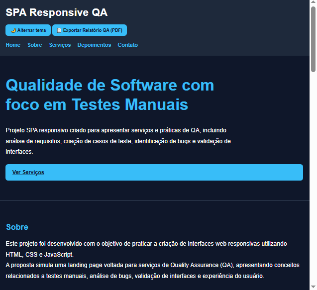
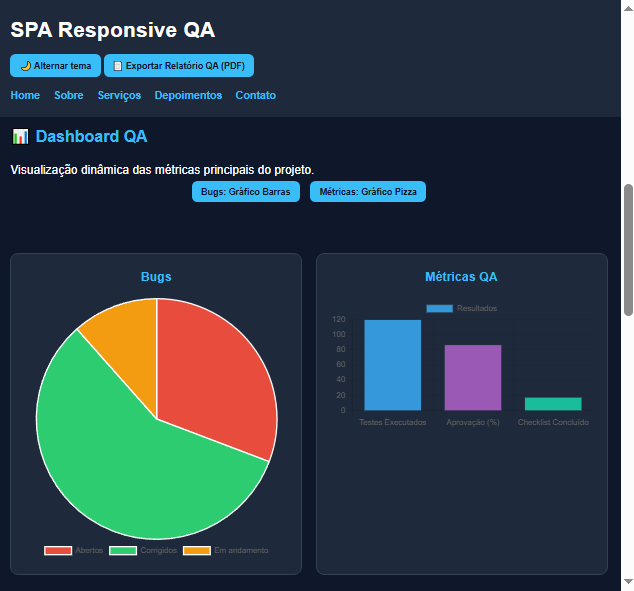
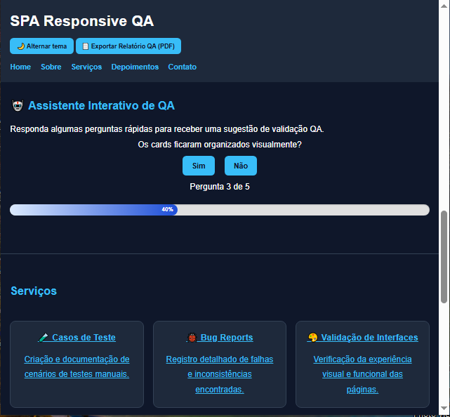
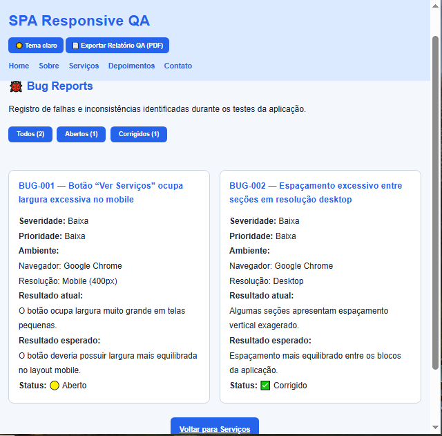

  
  
  

## 👩‍💻 Expert

<table align="center">
  <tr>
    <td align="center">
      <a href="https://github.com/flaviapaiva234">
         
        
          <b>Flávia Paiva</b>
        
      </a>
    </td>
    <td>
      
🎯 Analisata de QA Júnior. 
      🌟 Desenvolvedora do projeto SPA Responsive QA. 
      👩‍💻 Habilidades: HTML, CSS, JavaScript, Lógica de Programação e Engenharia de Prompt.
      

      
      
    </td>
  </tr>
</table>

# 💻 SPA Responsive QA

## 📖 Sobre o Projeto

Este projeto consiste no desenvolvimento de uma SPA (Single Page Application) responsiva voltada para apresentação de serviços e portfólio na área de QA (Quality Assurance).

A aplicação foi desenvolvida com foco em:

- Organização visual
- Responsividade mobile
- Experiência do usuário (UX)
- Estruturação semântica com HTML
- Estilização moderna com CSS
- Interatividade utilizando JavaScript
- Simulação de fluxos reais da área de QA

O projeto evoluiu para incluir funcionalidades mais dinâmicas e modernas, como:

- Assistente Interativo de QA
- Dashboard QA
- Modal interativo
- Barra de progresso animada
- Exportação de relatório em PDF
- Cards interativos de serviços

O objetivo do projeto é simular uma aplicação profissional voltada para Quality Assurance, proporcionando uma experiência moderna, responsiva e interativa inspirada em plataformas reais utilizadas no mercado de tecnologia.

---

## ✨ Funcionalidades

### 🎨 Interface e Experiência
- ✅ Landing page responsiva para QA
- ✅ Navegação suave entre seções (scroll)
- ✅ Cards interativos de serviços QA
- ✅ Modal interativo com exibição dinâmica
- ✅ Barra de progresso animada
- ✅ Interface moderna e dinâmica
- ✅ Responsividade mobile com menu adaptado
- ✅ Organização visual otimizada

### 🧪 Recursos de QA
- ✅ Página de Casos de Teste
- ✅ Página de Bug Reports (com filtros)
- ✅ Página de Checklist QA
- ✅ Dashboard QA interativo com gráficos (Chart.js)
- ✅ Filtro dinâmico de bugs por status
- ✅ Contadores automáticos de bugs
- ✅ Estado ativo nos botões de filtro

### 🤖 Interatividade com JavaScript
- ✅ Assistente Interativo de QA (5 perguntas)
- ✅ Perguntas sequenciais com JavaScript
- ✅ Barra de progresso animada nas respostas
- ✅ Resumo automático da análise QA
- ✅ Exportação de relatório em PDF (impressão nativa)
- ✅ Contadores dinâmicos com animação
- ✅ Tema claro/escuro com persistência (localStorage)

---

## 🧠 Assistente Interativo de QA

O projeto conta com um Assistente Interativo de QA que guia o usuário por uma sequência de perguntas relacionadas à validação da aplicação. Ao final do fluxo, uma análise automatizada é exibida com base nas respostas fornecidas.

A funcionalidade foi desenvolvida para simular experiências modernas de validação utilizadas em processos de Quality Assurance.

### 🔍 Cenários avaliados

- Carregamento da aplicação
- Navegação entre seções
- Organização visual dos cards
- Responsividade mobile
- Legibilidade dos textos
- Experiência do usuário (UX)
- Interatividade dos componentes

### ⚙️ Recursos implementados

- Perguntas sequenciais gerenciadas com JavaScript
- Barra de progresso animada
- Processamento dinâmico de respostas
- Geração automática de análise QA
- Integração com Dashboard QA
- Modal interativo para exibição de detalhes
- Exportação de relatório em PDF

### 💡 Diferencial

O fluxo simula uma validação rápida inspirada em checklists e processos reais de QA manual, demonstrando habilidades em:

- Manipulação de DOM
- Lógica de programação
- Interatividade com JavaScript
- Experiência do usuário (UX)
- Organização de fluxos dinâmicos

---

## 📚 Pré-requisitos de Habilidades

Para melhor compreensão do projeto, é recomendado possuir conhecimentos básicos em:

### 🖥️ Fundamentos Web

- HTML5 semântico
- CSS3 e responsividade
- Estruturação de interfaces SPA

### ⚙️ Lógica e Interatividade

- JavaScript (manipulação de DOM e eventos)
- Lógica de programação
- Interatividade e fluxos dinâmicos
---

## 🛠️ Tecnologias Utilizadas

### 🌐 Front-end
- HTML5
- CSS3
- JavaScript (ES6+)

### 🎨 Interface e Experiência
- Responsividade Mobile First
- Manipulação de DOM
- Componentes interativos
- Animações com JavaScript

### 📄 Recursos Implementados
- Geração de relatório em PDF
- Dashboard QA interativo
- Modal dinâmico
- Barra de progresso animada

### 🔧 Versionamento e Deploy
- Git
- GitHub
- GitHub Pages

---

## 🚀 Habilidades Desenvolvidas

Durante o projeto, foram praticados conceitos fundamentais de front-end e lógica de programação, com destaque para:

- Estruturação de páginas com **HTML5 semântico**
- Estilização moderna com **CSS3** (Flexbox, Grid e responsividade)
- Organização de layout **SPA** (Single Page Application)
- Manipulação avançada de **DOM** com JavaScript
- Eventos e interatividade (filtros, formulários e assistente)
- Controle de estados visuais com **JavaScript puro**
- Simulação de fluxo de QA (documentação de testes, bugs e checklist)

### ✨ Funcionalidades interativas implementadas

- ✅ **Assistente Interativo de QA** – perguntas sequenciais com barra de progresso e análise automática
- ✅ **Exportação de relatório em PDF** utilizando impressão nativa do navegador (`window.print`)
- ✅ **Gráficos dinâmicos** com Chart.js (alternância entre gráfico de pizza e barras)
- ✅ **Tema claro/escuro** com persistência utilizando `localStorage`
- ✅ **Dashboard QA** com métricas visuais e botões interativos
- ✅ **Filtro de bugs** com contadores automáticos
- ✅ **Animações** (contadores e barra de progresso)

### 🛠️ Ferramentas e versionamento

- Git
- GitHub
- GitHub Pages

---

## 🎯 Objetivos e Resultados Esperados

Ao concluir este projeto, foi possível:

- Criar uma SPA responsiva com navegação suave
- Desenvolver layouts modernos com foco em UX
- Estruturar páginas de portfólio para a área de QA
- Aplicar boas práticas de front-end (semântica, acessibilidade e responsividade)
- Desenvolver funcionalidades interativas: assistente, filtros, gráficos e tema escuro
- Aplicar lógica com JavaScript para processamento de dados e feedback visual
- Simular cenários reais de validação e documentação QA
- Organizar documentação de testes de forma clara e profissional
- Gerar relatórios em PDF com qualidade utilizando impressão nativa do navegador

---

## 📂 Estrutura do Projeto

- `index.html` → Página principal da aplicação (Landing Page QA)
- `casos-de-teste.html` → Casos de teste documentados
- `bugs.html` → Registro de bugs com filtros interativos
- `checklist-qa.html` → Checklist de validação QA
- `style.css` → Estilização global e responsiva da aplicação
- `script.js` → Funcionalidades interativas (assistente QA, dashboard, gráficos, tema dark/light, exportação PDF e animações)
- `testes/` → Documentações e registros QA
- `imagens/` → Screenshots, previews e assets visuais do projeto

---

## 📸 Preview do Projeto

### 🏠 Página Principal (Tema Escuro)

*Landing page com navegação SPA, cards de serviços e chamada para ação.*

---

### 📊 Dashboard QA

*Dashboard com gráficos dinâmicos (pizza e barras) para visualização de bugs e métricas de QA.*

---

### 🤖 Assistente Interativo de QA

*Assistente que guia o usuário por 5 perguntas, com barra de progresso e análise automática ao final.*

---

### 🐞 Bug Reports (Tema Claro)

*Página de bug reports com filtros por status (todos, abertos, corrigidos) e contadores dinâmicos em tempo real.*

---

## 🌐 Projeto Online

Acesse a versão publicada do projeto:

https://flaviapaiva234.github.io/spa-responsive-qa/

---

## 👩‍💻 Autora

Flávia Paiva

🔎 Analisata de QA Júnior  
🐞 Testes Manuais | Casos de Teste | Identificação de Bugs
